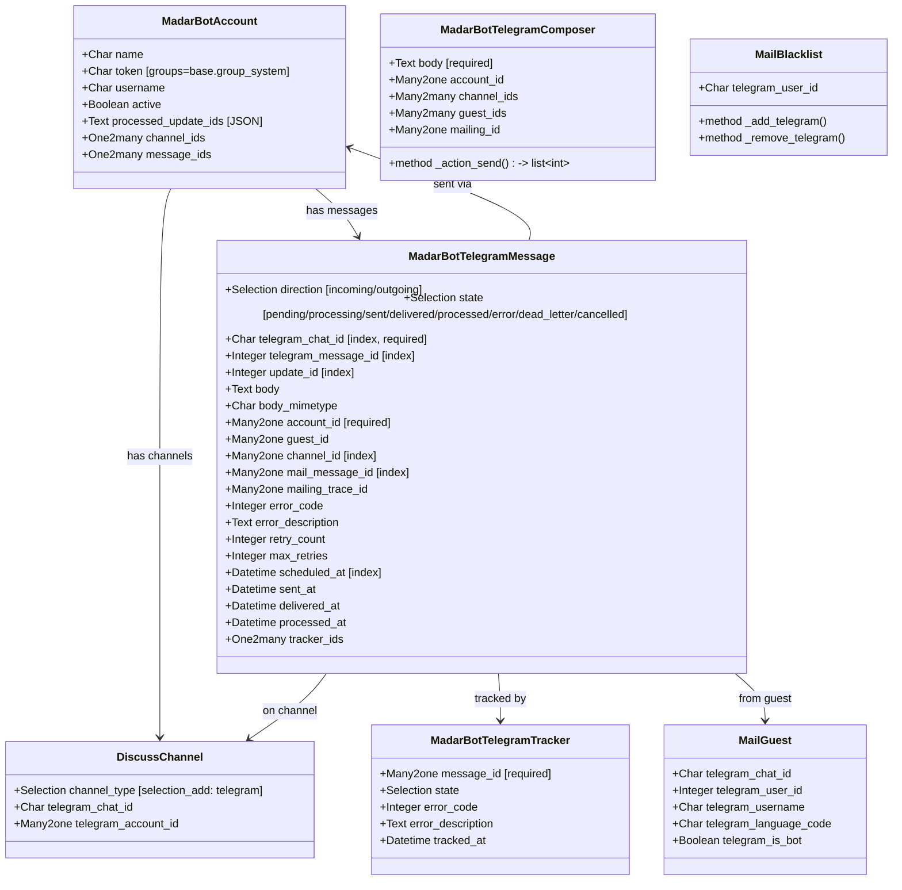
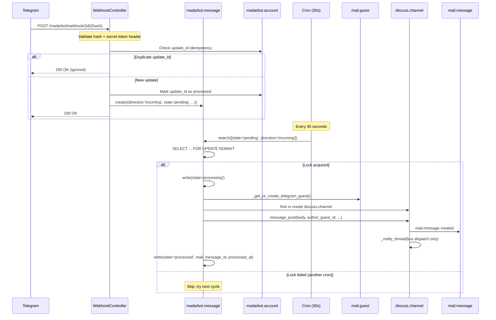
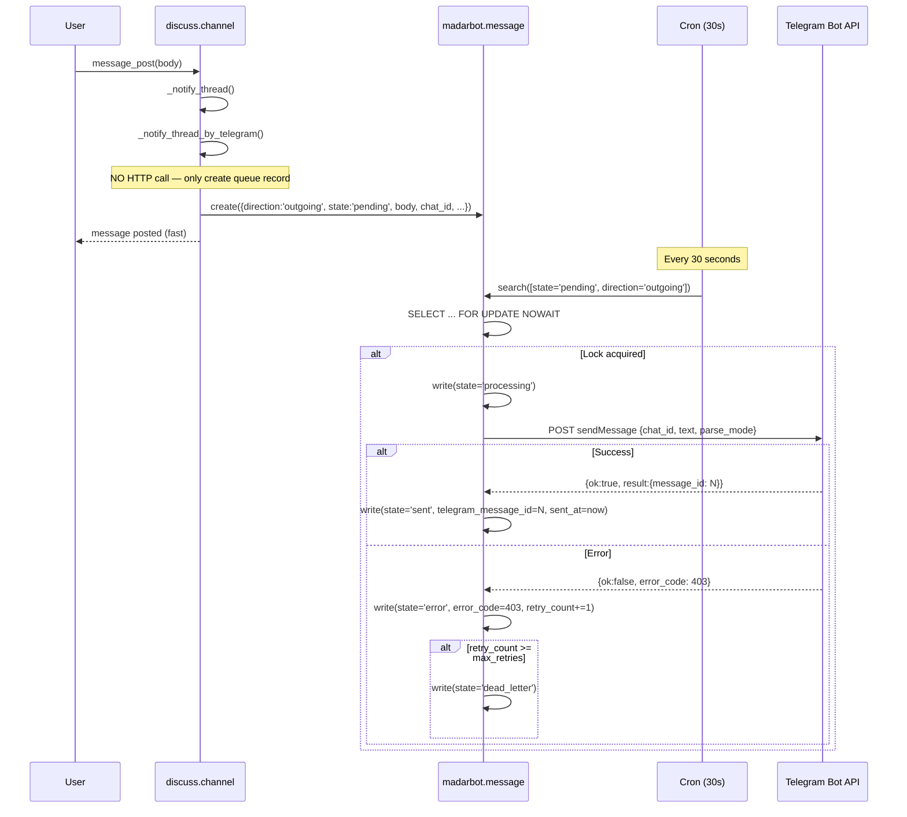
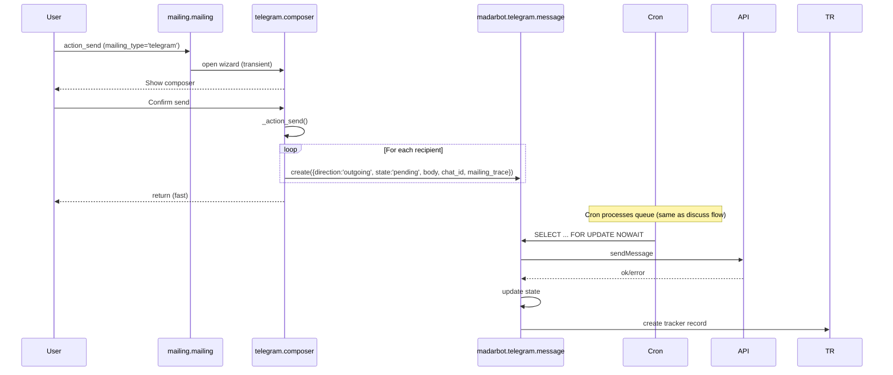

# MadarBot Bridge — Production Architecture

## Design Principles

Following Odoo 19 Enterprise internal patterns exactly:

| Odoo Pattern | Telegram Equivalent | Rationale |
|---|---|---|
| `sms.sms` (message queue) | `madarbot.telegram.message` | State machine + cron processing |
| `sms.composer` (transient) | `madarbot.telegram.composer` | Wizard pattern for composition |
| `sms.tracker` (delivery) | `madarbot.telegram.tracker` | Delivery status logging |
| `mail.message_schedule` (deferred) | `scheduled_at` field | Deferred delivery |
| `mail._notify_thread_by_*` | `_notify_thread` → queue create | No HTTP in models |
| `mailgateway message_process` | Webhook → incoming queue → cron | Async, idempotent ingestion |
| `bus.bus` precommit/postcommit | Cron-based dispatch | Transaction-safe outbound |
| `SELECT FOR UPDATE NOWAIT` | Same pattern | Concurrent cron safety |

## Core Principle

**No synchronous network calls in ORM methods.** All Telegram API communication happens in dedicated cron jobs that process queue records with proper locking.

---

## State Machines

### Outgoing Message States

```
                        ┌──────────┐
                        │  PENDING │
                        └────┬─────┘
                             │ cron picks up
                             ▼
                     ┌───────────────┐
                     │  PROCESSING   │
                     │ (FOR UPDATE)  │
                     └───┬───────┬───┘
                         │       │
                  API OK │       │ API error
                         ▼       ▼
                   ┌────────┐ ┌───────┐
                   │  SENT  │ │ ERROR │
                   └────┬───┘ └───┬───┘
                        │         │
                   ┌────▼────┐  retry_count++
                   │DELIVERED│  < max_retries?
                   │(webhook)│     │        │
                   └─────────┘  yes       no
                                  │        │
                                  ▼        ▼
                            ┌────────┐ ┌────────────┐
                            │PENDING │ │DEAD_LETTER │
                            │(retry) │ └────────────┘
                            └────────┘
```

### Incoming Message States

```
         ┌─────────┐
         │ PENDING │
         └────┬────┘
              │ cron picks up
              ▼
      ┌──────────────┐
      │  PROCESSING  │
      │ (FOR UPDATE) │
      └───┬──────┬───┘
          │      │
   success │      │ error
          ▼      ▼
    ┌─────────┐ ┌───────┐
    │PROCESSED│ │ ERROR │
    └─────────┘ └───┬───┘
                    │
               retry_count++
               < max_retries?
               │          │
              yes         no
               │          │
               ▼          ▼
          ┌────────┐ ┌────────────┐
          │PENDING │ │DEAD_LETTER │
          └────────┘ └────────────┘
```

---

## Data Model



---

## Sequence Diagrams

### Incoming Telegram Message



### Outgoing Telegram Message (from Discuss)



### Outgoing Telegram Message (from Mass Mailing)



---

## Migration Plan

### Phase 1: Remove Anti-patterns (before production)

1. **Remove `madarbot.telegram.channel` model** — duplicate of `discuss.channel` fields
2. **Remove dead code**: `_get_telegram_send_method`, `_set_webhook_typing`, `_get_webhook_base_url`, `webhook_secret` field
3. **Remove unused dependencies**: `mass_mailing`, `base_automation`, `approvals` from bridge manifest
4. **Remove unused imports**: `hmac`, `defaultdict`, `api`, `hashlib` (from module level)

### Phase 2: Add Queue Models

1. Create `madarbot.telegram.message` model with state machine
2. Create `madarbot.telegram.composer` (transient, like `sms.composer`)
3. Create `madarbot.telegram.tracker` model (like `sms.tracker`)
4. Add `SELECT FOR UPDATE NOWAIT` locking pattern to cron processing
5. Add `processed_update_ids` JSON field to `madarbot.account`
6. Create `_process_incoming_messages` cron (30s interval)
7. Create `_process_outgoing_messages` cron (30s interval)
8. Create `_cleanup_processed_updates` cron (daily)

### Phase 3: Refactor Controllers

1. Webhook: validate `X-Telegram-Bot-Api-Secret-Token` header
2. Webhook: create queue record only, return immediately
3. Webhook: idempotency via `update_id` stored on account
4. Remove all `sudo()` scatter — use `request.env.sudo()` once

### Phase 4: Refactor Models

1. `discuss_channel.py`: `_notify_thread` creates queue record, never calls HTTP
2. `madarbot_guest.py`: remove `_set_auth_cookie()` from webhook path
3. `mail_blacklist.py`: fix `_search` override name, or use dedicated blacklist model
4. `mailing_mailing.py`: delegate to `telegram.composer` instead of HTTP

### Phase 5: SQL Data Migration

```sql
-- No data migration needed (no production data yet)
-- If upgrading from v1 prototype:
-- ALTER TABLE madarbot_telegram_message ADD COLUMN ...
```

### Phase 6: Security Hardening

1. `madarbot.account.token` stays `groups=base.group_system`
2. Add ACLs for `mass_mailing_telegram` (currently empty)
3. Webhook endpoint has no session overhead (stateless)
4. Rate limiter uses atomic SQL UPSERT instead of TOCTOU pattern
