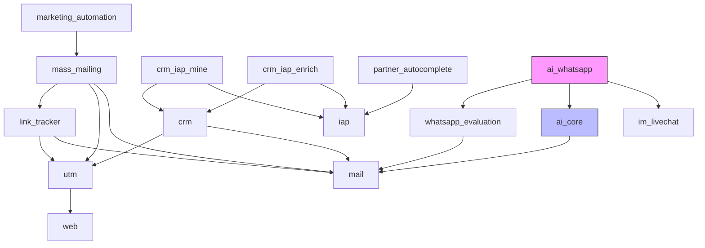
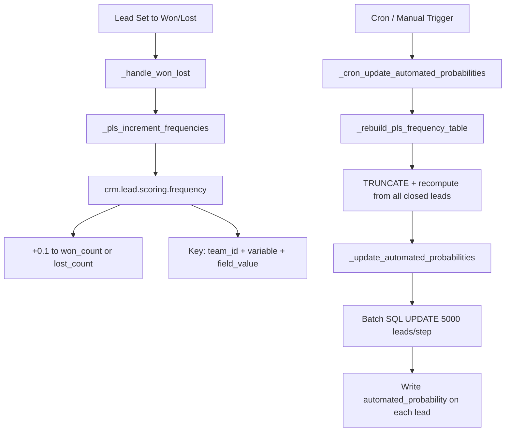
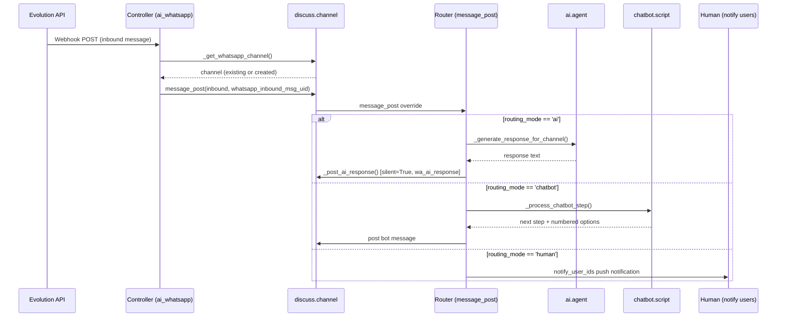

# Odoo 19.0 AI-Powered Marketing Automation — Implementation Guide

> **Based on actual source code analysis.**
> Community/Enterprise: `/usr/lib/python3/dist-packages/odoo/addons/`
> Custom addons: `/mnt/custom-addons/` | Project: `/root/odoo/project/addons/custom/`

---

## Table of Contents

1. [Dependency Graph](#1-dependency-graph)
2. [Module Catalog & Architecture](#2-module-catalog)
3. [Predictive Lead Scoring (PLS)](#3-predictive-lead-scoring)
4. [Marketing Automation Campaign Engine](#4-marketing-automation-engine)
5. [Email Marketing (mass_mailing) Internals](#5-email-marketing-internals)
6. [WhatsApp + AI Routing Architecture](#6-whatsapp--ai-routing)
7. [AI Agent Platform](#7-ai-agent-platform)
8. [IAP Service Integration](#8-iap-service-integration)
9. [Extension Points & Customization](#9-extension-points)
10. [AI Integration Patterns](#10-ai-integration-patterns)
11. [Performance & Anti-Patterns](#11-performance--anti-patterns)
12. [Security Matrix](#12-security-matrix)
13. [Migration from v18](#13-migration-from-v18)
14. [Implementation Cookbook](#14-implementation-cookbook)
15. [Testing Strategy](#15-testing-strategy)

---

## 1. Dependency Graph



**Module Locations:**
- `mass_mailing` v2.7 — `Marketing/Email Marketing` | `mailing.mailing` (1537-line core model)
- `crm` v1.9 — `Sales/CRM` | `crm.lead` (massive model with 17 mixins)
- `marketing_automation` v19.0 — `Marketing` | OEEL-1 Enterprise
- `ai` core — `Productivity` | `ai.agent` with LLM integration
- `crm_iap_mine/enrich` — OEEL-1 | IAP-powered lead gen/enrichment

---

## 2. Module Catalog

### 2.1 mass_mailing (Email Marketing) — v2.7

**File:** `addons/mass_mailing/`
**License:** LGPL-3 | **Application:** Yes

**Key Models:**

| Model | File | Inherits |
|---|---|---|
| `mailing.mailing` | `models/mailing.py` | `mail.thread`, `mail.activity.mixin`, `mail.render.mixin`, `utm.source.mixin` |
| `mailing.list` | `models/mailing_list.py` | `mail.thread.blacklist` (via contact) |
| `mailing.contact` | `models/mailing_contact.py` | `mail.thread.blacklist`, `properties.base.definition.mixin` |
| `mailing.trace` | `models/mailing_trace.py` | Base |
| `mailing.subscription` | `models/mailing_subscription.py` | Base (custom table `mailing_subscription`) |
| `mailing.filter` | `models/mailing_filter.py` | Base |

**State Machine:** `draft → in_queue → sending → done`

**Key Business Methods:**
- `_process_mass_mailing_queue()` — cron: picks up `in_queue` mailings, sends or marks done
- `_action_send_mail()` — creates `mail.compose.message` in mass-mailing mode → `mail.mail` records with `mailing_trace_ids`
- `convert_links()` — overridden in MA to add UTM campaign/source context
- `_get_recipients()` — applies A/B test random sampling, deduplicates against seen list

### 2.2 CRM — v1.9

**File:** `addons/crm/`
**License:** LGPL-3 | **Application:** Yes

**Key Models:**

| Model | File | Inherits |
|---|---|---|
| `crm.lead` | `models/crm_lead.py` | 7 mixins: `mail.thread.cc`, `mail.thread.blacklist`, `mail.thread.phone`, `mail.activity.mixin`, `utm.mixin`, `format.address.mixin`, `mail.tracking.duration.mixin` |
| `crm.stage` | `models/crm_stage.py` | Base |
| `crm.team` | `models/crm_team.py` | `sales_team.crm.team` (extended) |
| `crm.team.member` | `models/crm_team_member.py` | `sales_team.crm.team.member` (extended) |
| `crm.lead.scoring.frequency` | `models/crm_lead_scoring_frequency.py` | Base (per `team_id`, `variable`, `value`) |
| `crm.lead.scoring.frequency.field` | `models/crm_lead_scoring_frequency.py` | Base (configurable PLS fields) |

### 2.3 marketing_automation — v19.0 Enterprise

**File:** `addons/marketing_automation/`
**License:** OEEL-1 | **Application:** Yes
**Depends:** `mass_mailing`

**Key Models:**

| Model | File | Role |
|---|---|---|
| `marketing.campaign` | `models/marketing_campaign.py` | Campaign orchestrator (state: draft/running/stopped) |
| `marketing.activity` | `models/marketing_activity.py` | Campaign step (9 trigger types, 2 activity types) |
| `marketing.participant` | `models/marketing_participant.py` | A record tracked through the campaign |
| `marketing.trace` | `models/marketing_trace.py` | Scheduled/processed execution trace |

**Participant State Machine:**
```
running ──> completed  (no more scheduled traces)
running ──> unlinked   (record removed from domain)
completed ──> running  (new parent traces on sync update)
```

**Trace State Machine:**
```
scheduled ──> processed  (success)
scheduled ──> rejected   (domain filter failed)
scheduled ──> error      (exception)
scheduled ──> canceled   (validity/opposite trigger)
```

### 2.4 What's NOT in this environment

- `website_analytics` — NOT found at the expected path
- `ai_app` — The UI shell exists but the core AI logic is in `ai/` (not `ai_app/`)

---

## 3. Predictive Lead Scoring (PLS)

### 3.1 Algorithm: Naive Bayes per Sales Team

**Formula (per team):**
```
P(Won | values) ∝ ∏ P(value|Won) × P(Won)
Score = P(Won) / (P(Won) + P(Lost))
Probability = Score × 100
```

**Source:** `crm/models/crm_lead.py` — `_pls_get_naive_bayes_probabilities()`

### 3.2 Frequency Table

**Model:** `crm.lead.scoring.frequency` — per `(team_id, variable, value)` with `won_count` (Float) and `lost_count` (Float)

Each increment adds **+0.1** (not +1) to avoid zero-probability multiplication.

### 3.3 Increment Flow



### 3.4 Config Parameters

| Key | Default | Purpose |
|---|---|---|
| `crm.pls_fields` | `phone_state,email_state,state_id,country_id,source_id,lang_id,tag_ids` | PLS variables |
| `crm.pls_start_date` | 8 days before install | Training window start |
| `crm.pls.compute.batch.step` | 50000 | Batch compute size (hardcoded) |
| `crm.pls.update.batch.step` | 5000 | Batch update size (hardcoded) |

### 3.5 Extension: Adding Custom PLS Fields

1. Create `crm.lead.scoring.frequency.field` record linked to `ir.model.fields` on `crm.lead`
2. Add field name to `crm.pls_fields` config parameter
3. Run `_cron_update_automated_probabilities()` to rebuild

---

## 4. Marketing Automation Campaign Engine

### 4.1 Campaign Lifecycle

```
DRAFT ──action_start_campaign()──> RUNNING
RUNNING ──action_stop_campaign()──> STOPPED
```

### 4.2 Participant Sync (12h cron)

`marketing.campaign.sync_participants()`:
1. Reads campaign domain filter
2. Compares existing participants vs target model records
3. Creates new `marketing.participant` for unmatched records (batch 100)
4. Removes participants for deleted records (state → `unlinked`)
5. Creates root traces for `begin`-trigger activities

### 4.3 Activity Execution (1h cron)

`marketing.campaign.execute_activities()` → `marketing.activity.execute()`:
1. Reads all due `scheduled` traces (schedule_date ≤ now)
2. Groups by activity, processes in batches of 500
3. For each trace: check validity duration → cancel if expired
4. Apply activity domain filter → reject if no match
5. **Email type**: `_execute_email()` → `mass_mailing_id.action_send_mail(res_ids)`
6. **Action type**: `_execute_action()` → `server_action_id.run()` per trace

### 4.4 Trigger Types

| Trigger | Behavior |
|---|---|
| `begin` | Executes on participant creation |
| `activity` | Executes after parent activity (time-based offset) |
| `mail_open` | Executes when email opened |
| `mail_not_open` | Executes after validity_duration if NOT opened |
| `mail_click` | Executes when link clicked |
| `mail_not_click` | Executes after validity_duration if NOT clicked |
| `mail_reply` | Executes when customer replies |
| `mail_not_reply` | Executes after validity_duration if NOT replied |
| `mail_bounce` | Executes on bounce (e.g., blacklist, retag) |

### 4.5 Event Processing

`mailing.trace.set_opened()` → `marketing_trace_id.process_event('mail_open')`:
1. Finds child traces with matching trigger type
2. If `interval_number=0`: executes immediately
3. Otherwise: schedules child trace with `now + interval_offset`
4. Cancels opposite trigger traces (e.g., `mail_open` cancels `mail_not_open`)

---

## 5. Email Marketing Internals

### 5.1 Sending Flow

```
User clicks Send
    │
    ▼
action_launch() → schedule_type='now'
    │
    ▼
action_put_in_queue() → state='in_queue' + cron._trigger()
    │
    ▼
_process_mass_mailing_queue() (cron picks up)
    │
    ▼
_action_send_mail()
    │
    ├─ Create mail.compose.message (mass_mail mode)
    ├─ For each recipient:
    │   ├─ Create mailing.trace (state=outgoing)
    │   ├─ Shorten links via _render_template_postprocess → _shorten_links
    │   ├─ Add tracking pixel URL (blank.gif with HMAC token)
    │   └─ Add personalized unsubscribe URLs
    ├─ Create mail.mail records with:
    │   ├─ List-Unsubscribe headers (one-click + URL)
    │   ├─ Precedence: bulk header
    │   └─ mailing_id + mailing_trace_ids
    └─ Set mailing state='done'
```

### 5.2 Tracking Pixel

URL pattern: `/mail/track/<mail_id>/<token>/blank.gif`
Token: HMAC of `mail.mail` ID, using `secret_key` from `mail.unsubscribe_secret_key` config

### 5.3 Link Tracking

All links in email body are automatically replaced with tracked short URLs:
`/r/<short_code>/m/<mailing_trace_id>` → 301 redirect to original URL

Click records: IP, country (geoip), timestamp

### 5.4 A/B Testing

```
Enable on campaign → Set N variants, each with:
  - ab_testing_pc% of recipients (random sample, no overlap)
  - Different body/template

After send → Compare metrics:
  - opened_ratio (default)
  - clicks_ratio
  - replied_ratio
  - leads/quotes/revenues generated

Winner selection → Cron or manual action:
  - Duplicate winning variant
  - Send to remaining recipients
```

---

## 6. WhatsApp + AI Routing Architecture

### 6.1 End-to-End Flow



### 6.2 Routing Fields (`ai_whatsapp/models/discuss_channel.py`)

| Field | Source | Purpose |
|---|---|---|
| `routing_mode` | `wa_account_id.routing_mode` | `ai`, `chatbot`, `human` |
| `current_handler_type` | channel field | Current handler (`ai`, `chatbot`, `human`) |
| `whatsapp_ai_agent_id` | computed from account | AI agent for this channel |
| `last_ai_response_time` | channel field | Cooldown tracking |
| `whastapp_ai_cooldown_seconds` | account field | Min interval between AI responses (default 60) |

### 6.3 Human Takeover

**Auto-detection:** When a human operator posts `message_type='comment'` on a WhatsApp channel that currently has `current_handler_type IN ('ai', 'chatbot')`, the system:
1. Sets `current_handler_type = 'human'`
2. Clears `chatbot_current_step_id`
3. Posts notification "This conversation has been taken over by a human operator"
4. Broadcasts to all channel members

**Manual:** Frontend "Take Over" button → RPC `/ai_whatsapp/forward_operator` → same flow

### 6.4 AI Response Cooldown

Prevents rapid-fire responses when customer sends multiple messages:
- Check: `now - last_ai_response_time < whatsapp_ai_cooldown_seconds`
- If cooldown active: skip AI response (message still stored, just no reply)

### 6.5 Chatbot Step Engine

1. **First message**: No `chatbot_current_step_id` → load welcome steps from script
2. **Answer matching**: `_match_whatsapp_answer(step, body_text)`:
   - Exact match → answer text
   - Numeric index → answer by position ("2" → 2nd option)
   - Substring → partial text match
3. **Step execution**: `chatbot.script.step._process_answer()` → returns next step
4. **Forward operator**: `forward_operator` step type → `action_human_takeover()`
5. **Script end**: No more steps → human takeover

---

## 7. AI Agent Platform

### 7.1 Architecture

```
ai.agent
  ├── name, subtitle, partner_id (auto-created AI identity)
  ├── llm_model (gpt-4o, gpt-4.1, gemini-2.5-pro, etc.)
  ├── llm_temp / response_style (creative|balanced|analytical|precise)
  ├── system_prompt
  ├── restrict_to_sources (RAG-only mode)
  ├── sources_ids → ai.agent.source (URLs, attachments)
  ├── topic_ids → ai.topic → tool_ids (ir.actions.server with use_in_ai=True)
  └── is_system_agent (default for all composers)
```

### 7.2 Response Generation Flow

```
_generate_response(prompt, chat_history, extra_system_context)
    │
    ├── _build_system_context() → system_prompt + date + timezone + topic instructions
    ├── _build_rag_context(prompt) → top-5 similar chunks via cosine distance
    ├── _retrieve_chat_history(channel, 20) → last N messages
    ├── Build tool list from topics → _get_ai_tools()
    │
    └── request_llm(system_prompts, user_prompts, tools, files, ...)
        │
        ├── OpenAI Responses API (supports web_search_preview grounding)
        ├── Gemini via OpenAI-compatible layer
        ├── Max 20 successive LLM calls
        ├── Max 20 tool calls per turn
        └── Tool execution → ir.actions.server._ai_tool_run()
```

### 7.3 RAG Embedding Pipeline

```
1. Source added (URL/binary) → status=processing
2. _cron_process_sources() → fetch content → create/update attachment
3. _cron_generate_embedding():
   - Chunk content into ai.embedding records (512-1024 tokens)
   - Generate embedding via text-embedding-3-small (1536d)
   - Store in vector field with ivfflat index
4. Query: _get_similar_chunks() → SQL `<=>` cosine distance → top 5
```

### 7.4 LLM Providers

| Provider | API Base | Models | Auth Config |
|---|---|---|---|
| OpenAI | `api.openai.com/v1` | gpt-4o, gpt-4.1, gpt-4.1-mini, gpt-5, gpt-5-mini | `ai.openai_key` or `ODOO_AI_CHATGPT_TOKEN` env |
| Google Gemini | `generativelanguage.googleapis.com/v1beta/openai` | gemini-2.5-pro, gemini-2.5-flash | `ai.google_key` or `ODOO_AI_GEMINI_TOKEN` env |

**API Style:** Uses OpenAI **Responses API** (not chat completions) which supports:
- `web_search_preview` for web grounding
- Structured outputs (JSON schema)
- Tool/function calling with loop

### 7.5 Tool Execution

`ir.actions.server` with `use_in_ai=True` exposes actions as LLM-callable tools:

| Field | Purpose |
|---|---|
| `ai_tool_description` | LLM tool description |
| `ai_tool_schema` | JSON schema for parameters |
| `ai_tool_allow_end_message` | If True, tool can end the conversation |
| `ai_action_prompt` | For `ai_action` type: the prompt template |

**Execution:** LLM decides to call tool → schema validation → `_ai_tool_run(record, arguments)` → result returned to LLM → LLM continues or ends.

---

## 8. IAP Service Integration

### 8.1 Architecture

```
iap.account
  ├── service_id → iap.service (name, technical_name)
  ├── account_token (system-only)
  ├── balance (fetched from iap.odoo.com)
  └── warning_threshold + warning_user_ids

Credit Flow:
  Service request → iap.account.get(service_name)
    → _contact_iap(endpoint, params)
    → JSON-RPC to iap.odoo.com
    → Credit validated, request processed
    → Result returned, credits deducted
```

### 8.2 Service Catalog

| Service | Module | Cost | IAP Endpoint |
|---|---|---|---|
| Lead Mining | `crm_iap_mine` | 1 lead + 1/contact | `/api/dnb/1/search_by_criteria` |
| Lead Enrichment | `crm_iap_enrich` | ~1/enrichment | `/iap/clearbit/1/lead_enrichment_email` |
| Partner Autocomplete | `partner_autocomplete` | Per lookup | `/api/dnb/1/search_by_name` |
| SMS | `mass_mailing_sms` | Per message | Odoo IAP SMS |
| Snailmail | `snailmail` | Per item | Odoo IAP mail |

### 8.3 Lead Mining Flow

```python
# crm_iap_mine/models/crm_iap_lead_mining_request.py
def action_submit(self):
    for request in self:
        payload = request._prepare_iap_payload()  # countries, industries, size, roles
        result = request._perform_request()       # POST to /api/dnb/1/search_by_criteria
        leads = request._create_leads_from_response(result)
```

### 8.4 Lead Enrichment Flow

```python
# crm_iap_enrich/models/crm_lead.py
def iap_enrich(self, batch_size=50):
    for lead in self:
        domain = extract_email_domain(lead.email_from)
        if domain in _MAIL_PROVIDERS:  # Gmail, Hotmail, etc.
            continue
        result = _request_enrich({lead.id: domain})
        lead._iap_enrich_from_response(result[lead.id])
```

### 8.5 Partner Autocomplete Flow

```python
# partner_autocomplete/models/res_partner.py
def autocomplete_by_name(self, query, country_id):
    return _request_partner_autocomplete('search_by_name', {
        'name': query, 'country_id': country_id
    })

def enrich_by_duns(self, duns):
    return _request_partner_autocomplete('enrich_by_duns', {'duns': duns})
```

---

## 9. Extension Points

### 9.1 mass_mailing Extension Points

| Hook/Method | File | Purpose |
|---|---|---|
| `_get_opt_out_list()` | `models/mailing.py:569` | Override opt-out logic |
| `_get_seen_list()` | `models/mailing.py:578` | Override already-sent detection |
| `_get_recipients_domain()` | `models/mailing.py:603` | Override recipient selection domain |
| `_get_mass_mailing_context()` | `models/mailing.py:594` | Override context for rendering |
| `_get_ab_testing_winner_selection()` | `models/mailing.py:718` | Custom A/B winner criteria |
| `_shorten_links()` | `mail.render.mixin` | Custom link tracking |

### 9.2 CRM Extension Points

| Hook/Method | File | Purpose |
|---|---|---|
| `_handle_won_lost()` | `models/crm_lead.py` | Custom won/lost logic |
| `_pls_increment_frequencies()` | `models/crm_lead.py` | Custom PLS training |
| `_find_matching_partner()` | `models/crm_lead.py` | Partner matching override |
| `_prepare_customer_values()` | `models/crm_lead.py` | Custom partner creation |
| `_compute_probabilities()` | `models/crm_lead.py` | Probability override |
| `sync_partner_address()` | `models/crm_lead.py` | Address sync override |

### 9.3 marketing_automation Extension Points

| Hook/Method | File | Purpose |
|---|---|---|
| `execute_on_traces()` | `models/marketing_activity.py` | Custom execution logic |
| `_execute_email()` | `models/marketing_activity.py` | Custom email sending |
| `_execute_action()` | `models/marketing_activity.py` | Custom server action execution |
| `_generate_children_traces()` | `models/marketing_activity.py` | Custom child workflow |
| `process_event(action)` | `models/marketing_trace.py` | Custom event handling |
| `sync_participants()` | `models/marketing_campaign.py` | Custom participant sync |
| `_get_reschedule_trigger_types()` | `models/marketing_activity.py` | Add custom reschedule triggers |

### 9.4 ai_whatsapp Extension Points

| Hook/Method | File | Purpose |
|---|---|---|
| `_get_whatsapp_handler()` | `models/discuss_channel.py` | Add custom routing modes |
| `_match_whatsapp_answer()` | `models/discuss_channel.py` | Custom chatbot answer matching |
| `_process_chatbot_step()` | `models/discuss_channel.py` | Custom chatbot engine |
| `_build_system_context()` (override) | `models/ai_agent.py` | Custom AI system prompt |
| `_retrieve_chat_history()` (override) | `models/ai_agent.py` | Custom chat history format |
| `_post_ai_response()` (override) | `models/ai_agent.py` | Custom response posting |
| `action_human_takeover()` | `models/discuss_channel.py` | Custom takeover logic |

---

## 10. AI Integration Patterns

### 10.1 AI Lead Qualification

**Entry Points:**
- `crm.lead.create()` / `crm.lead.write()` — Override to call AI on new/changed leads
- `crm.lead._onchange_partner_id()` — Trigger AI enrichment
- `mail.thread._message_route_process()` — AI parse inbound email

**Pattern:**
```python
@api.model_create_multi
def create(self, vals_list):
    records = super().create(vals_list)
    for record in records:
        if record.agent_id:
            agent = record.agent_id
            prompt = f"Qualify this lead: {record.name}, {record.email_from}, {record.partner_name}"
            response = agent._generate_response(prompt, [], "")
            # Parse response → set probability, stage_id, tag_ids
    return records
```

### 10.2 AI Content Generation in Email Templates

**Entry Points:**
- `mail.render.mixin._render_template()` — AI prompt evaluation already built in
- `mailing.mailing.body_arch` — Insert `<div class="o_editor_prompt">` with LLM instructions

**Pattern (built-in, no custom code needed):**
```xml
<div class="o_editor_prompt" data-prompt="Write a professional email subject line for a 20% discount offer on winter collection."></div>
```
The `ai.agent._eval_ai_prompts()` method replaces these divs with LLM-generated content.

### 10.3 AI Server Actions in Marketing Automation

**Entry Points:**
- `marketing.activity` with `activity_type='action'`
- `ir.actions.server` with `use_in_ai=True`

**Pattern:**
1. Create `ir.actions.server` with:
   - `use_in_ai = True`
   - `ai_tool_description = "Analyze lead engagement and decide next step"`
   - `ai_action_prompt = "Based on the lead's email interaction..."`
2. Create `marketing.activity` with `activity_type='action'`, pointing to this server action
3. When the campaign reaches this step: `server_action_id.run()` → `_ai_action_run()` → LLM executes tool with lead data → returns decision

### 10.4 WhatsApp AI Agent with Custom Tools

**Pattern:**
1. Create `ai.topic` records for different customer intents (Product Inquiries, Order Support, etc.)
2. Create `ir.actions.server` with `use_in_ai=True` for each tool (Search Products, Get Order Status)
3. Create `ai.agent` with topics and tools linked
4. Assign agent to `whatsapp.account.ai_agent_id`
5. Set account routing_mode = `'ai'`

### 10.5 Multi-Agent Workflows

For complex conversations requiring handoff between specialized agents:

**Pattern:**
```python
class CustomAgent(ai.agent):
    def _generate_response(self, prompt, chat_history, extra_system_context):
        # Route to specialized sub-agent based on intent classification
        intent = self._classify_intent(prompt)
        if intent == 'order':
            specialized_agent = self.env.ref('my_module.order_agent')
        elif intent == 'product':
            specialized_agent = self.env.ref('my_module.product_agent')
        else:
            specialized_agent = self  # general agent

        # Delegate to specialized agent
        return specialized_agent._generate_response(prompt, chat_history, extra_system_context)
```

---

## 11. Performance & Anti-Patterns

### 11.1 Known Performance Optimizations

| Module | Optimization | Location |
|---|---|---|
| mass_mailing | Raw SQL for statistics (not Python loops) | `mailing.mailing._compute_statistics` |
| mass_mailing | Batch processing for retries (`batch_size=1000`) | `mailing.mailing.action_retry_failed` |
| mass_mailing | Pre-fetched opt-out/seen caches before batch sends | `_get_opt_out_list`, `_get_seen_list` |
| crm PLS | Batch SQL with `PLS_COMPUTE_BATCH_STEP=50000` | `crm.lead._pls_get_naive_bayes_probabilities` |
| crm PLS | Frequency table incrementally updated (no full rebuild) | `crm.lead._pls_increment_frequencies` |
| link_tracker | `_read_group` aggregation for click counts | `link.tracker.count` compute |
| marketing_automation | Batch traces in groups of 500 | `marketing.activity.execute_on_traces` |
| marketing_automation | `cron._trigger(dates)` for near-real-time execution | Multiple trace creation points |
| ai | Embedding index with ivfflat | `ai.embedding._get_similar_chunks` |

### 11.2 Anti-Patterns to Avoid

```python
# BAD: Iterating contacts one by one
for contact in mailing_list.contact_ids:
    contact.write({'opt_out': True})
# GOOD: Batch write
mailing_list.contact_ids.write({'opt_out': True})

# BAD: Per-lead PLS computation
for lead in leads:
    prob = lead._pls_get_naive_bayes_probabilities()
# GOOD: Batch cron recompute
leads._cron_update_automated_probabilities()

# BAD: Creating traces individually
for participant in participants:
    trace = marketing.trace.create({...})
# GOOD: Batch create
traces = marketing.trace.create([{...}, {...}])

# BAD: Not triggering cron after trace creation
trace = marketing.trace.create({...})
# GOOD: Trigger cron for near-real-time execution
cron = self.env.ref('marketing_automation.ir_cron_campaign_execute_activities')
cron._trigger(at=schedule_date)

# BAD: Processing mailing events one-by-one
for trace in mailing_traces:
    trace.set_opened()
# GOOD: Batch process (mailing.trace override handles individual)
mailing_traces.write({'trace_status': 'open'})  # set_opened called per trace
```

---

## 12. Security Matrix

### 12.1 mass_mailing

| Group | Models | Permissions |
|---|---|---|
| `group_mass_mailing_user` | mailing.mailing, list, contact, trace | CRUD |
| `group_mass_mailing_user` | mailing.trace.report | Read only |
| `group_mass_mailing_user` | ir.mail_server | Read only |
| `group_mass_mailing_campaign` | (inherits from user) | Can manage campaigns |
| `base.group_system` | mailing.mailing | Full access |

### 12.2 CRM

| Group | Models | Permissions |
|---|---|---|
| `sales_team.group_sale_salesman` | crm.lead | CRU (no delete) |
| `sales_team.group_sale_manager` | crm.lead | Full CRUD |
| `sales_team.group_sale_salesman` | crm.stage | Read only |
| `sales_team.group_sale_manager` | crm.stage | Full CRUD |
| `sales_team.group_sale_salesman` | crm.lead.scoring.frequency | Read only |
| `base.group_system` | crm.lead.scoring.frequency | Read only |

**Record Rules:**
- Personal rule: `['|', ('user_id','=',user.id), ('user_id','=',False)]` (salesman sees own + unassigned)
- Company rule: `[('company_id','in',company_ids+[False])]` (multi-company)
- All leads rule: `[(1,'=',1)]` (`group_sale_salesman_all_leads` sees all)

### 12.3 marketing_automation

| Group | Models | Permissions |
|---|---|---|
| `group_marketing_automation_user` | marketing.campaign, activity, participant, trace | CRUD |
| Also inherits: `base.group_user` + `mass_mailing.group_mass_mailing_user` | | |

### 12.4 AI Platform

| Group | ai.agent | ai.embedding | ai.topic | ai.composer |
|---|---|---|---|---|
| `base.group_user` | Read | Read | Read | Read |
| `base.group_system` | Full CRUD | Full CRUD | Full CRUD | Full CRUD |

**AI Tools:** Execute with `sudo()` automatically. All `ir.actions.server` with `use_in_ai=True` run in superuser context.

### 12.5 WhatsApp

| Group | Model | Permissions |
|---|---|---|
| `group_whatsapp_admin` | whatsapp.account | Full CRUD |
| `group_whatsapp_admin` | whatsapp.template | Full CRUD |
| `group_whatsapp_admin` | whatsapp.message | CRU (no delete) |
| `admin` | whatsapp.message | CRUD |
| `group_whatsapp_admin` | chatbot.script (via ai_whatsapp) | CRUD |

**Record Rules:**
- `whatsapp.account` — multi-company: `allowed_company_ids`
- `whatsapp.message` — user sees own + admin sees all

---

## 13. Migration from v18

### 13.1 Breaking Changes

| Module | Change | Impact |
|---|---|---|
| `mail.render.mixin` | `_shorten_links` moved from `link.tracker` | Replace `convert_links` calls |
| `link_tracker` | `search_or_create()` expects `list[dict]` | Update single-dict calls |
| `mailing.mailing` | `_get_recipients_domain()` returns `Domain` object | Adapt domain methods |
| `crm` | `_handle_won_lost` replaces older frequency methods | Update PLS hooks |
| `sms` v3.0 | `auto_install` enabled | Available without explicit install |
| `mass_mailing` v2.7 | `html_builder` dependency | Asset bundles for email builder |

### 13.2 Migration Checklist

```python
# v18 style
links = link_tracker.search_or_create({'url': url, 'campaign_id': campaign_id})

# v19 style
links = link_tracker.search_or_create([{'url': url, 'campaign_id': campaign_id}])
```

```python
# v18 style
domain = self._get_recipients_domain()
recipients = self.env[self.mailing_model_real].search(domain)

# v19 style
domain = self._get_recipients_domain()
recipients = self.env[self.mailing_model_real].search(domain)  # domain is now Domain object, still .search() compatible
```

### 13.3 New Features (no migration needed)

- `ai_app` / `ai` module — entirely new in 19.0
- `marketing_automation` campaign templates — 5 new pre-built templates
- AI prompts in email templates (`<div class="o_editor_prompt">`)
- AI Fields, AI Server Actions, AI Agents
- WhatsApp routing (AI/Chatbot/Human) — custom module in this project

---

## 14. Implementation Cookbook

### 14.1 Set Up Predictive Lead Scoring

```python
# 1. Ensure PLS fields are configured (in Settings or via code)
fields_to_enable = ['state_id', 'country_id', 'phone_state', 'email_state', 'source_id', 'lang_id', 'tag_ids']
config = self.env['ir.config_parameter'].sudo()
config.set_param('crm.pls_fields', ','.join(fields_to_enable))
config.set_param('crm.pls_start_date', '2026-01-01')

# 2. Force PLS cron to run
cron = self.env.ref('crm.website_crm_score_cron')
cron._trigger(at=fields.Datetime.now())

# 3. Or trigger manually
leads = self.env['crm.lead'].search([])
leads._cron_update_automated_probabilities()
```

### 14.2 Create a Marketing Automation Campaign Programmatically

```python
# Create campaign
campaign = self.env['marketing.campaign'].create({
    'name': 'Welcome Series',
    'model_id': self.env.ref('base.model_res_partner').id,
    'domain': [('is_company', '=', True)],
})

# Create activities (begin -> email -> child email after 3 days)
act1 = self.env['marketing.activity'].create({
    'name': 'Welcome Email',
    'campaign_id': campaign.id,
    'trigger_type': 'begin',
    'activity_type': 'email',
    'mass_mailing_id': welcome_mailing.id,
    'interval_number': 0,  # immediate
})

act2 = self.env['marketing.activity'].create({
    'name': 'Follow-up Email',
    'campaign_id': campaign.id,
    'trigger_type': 'activity',
    'activity_type': 'email',
    'mass_mailing_id': followup_mailing.id,
    'parent_id': act1.id,
    'interval_number': 3,
    'interval_type': 'days',
})

# Start campaign
campaign.action_start_campaign()
```

### 14.3 Add AI Agent to WhatsApp

```python
# 1. Create AI agent
agent = self.env['ai.agent'].create({
    'name': 'WhatsApp Support Agent',
    'llm_model': 'gpt-4o',
    'response_style': 'balanced',
    'system_prompt': 'You are a professional WhatsApp customer support agent...',
})

# 2. Assign to WhatsApp account
account = self.env['whatsapp.account'].browse(account_id)
account.write({
    'routing_mode': 'ai',
    'ai_agent_id': agent.id,
    'whatsapp_ai_cooldown_seconds': 60,
})
```

### 14.4 Create AI Tool for Marketing Automation

```python
# Create server action with AI capabilities
server_action = self.env['ir.actions.server'].create({
    'name': 'AI: Analyze Lead Engagement',
    'model_id': self.env.ref('crm.model_crm_lead').id,
    'state': 'code',
    'code': """
records = env['crm.lead'].browse(active_ids)
if records:
    agent = env['ai.agent'].search([('is_system_agent', '=', True)], limit=1)
    if agent:
        prompt = f"Analyze this lead's engagement level: {records[0].name}"
        response = agent._generate_response(prompt, [], "")
        # Parse response and update lead
""",
    'use_in_ai': True,  # Makes it available as LLM tool
    'ai_tool_description': 'Analyze lead engagement and suggest next action',
})

# Use in marketing automation
activity = self.env['marketing.activity'].create({
    'name': 'AI Analysis Step',
    'campaign_id': campaign.id,
    'trigger_type': 'mail_open',
    'activity_type': 'action',
    'server_action_id': server_action.id,
})
```

### 14.5 Add Custom PLS Field

```python
# Add industry_id as PLS variable
field = self.env['ir.model.fields'].search([
    ('model', '=', 'crm.lead'),
    ('name', '=', 'industry_id'),
], limit=1)

self.env['crm.lead.scoring.frequency.field'].create({
    'field_id': field.id,
})

# Update config
config = self.env['ir.config_parameter'].sudo()
existing = config.get_param('crm.pls_fields', '')
config.set_param('crm.pls_fields', existing + ',industry_id')

# Rebuild
leads = self.env['crm.lead'].search([])
leads._cron_update_automated_probabilities()
```

### 14.6 Add New Marketing Activity Trigger Type

```python
# 1. Extend activity.trigger_type selection
class MarketingActivity(models.Model):
    _inherit = 'marketing.activity'

    trigger_type = fields.Selection(selection_add=[('webhook', 'Webhook Received')])

    def _get_reschedule_trigger_types(self):
        res = super()._get_reschedule_trigger_types()
        res.discard('webhook')  # event-based, not time-based
        return res

# 2. Handle event in trace
class MarketingTrace(models.Model):
    _inherit = 'marketing.trace'

    def process_event(self, action):
        if action == 'webhook':
            child_traces = self.child_ids.filtered(
                lambda t: t.activity_id.trigger_type == 'webhook'
            )
            for trace in child_traces:
                if not trace.activity_id.interval_number:
                    trace.action_execute()
                else:
                    trace.schedule_date = fields.Datetime.now() + timedelta(
                        hours=trace.activity_id.interval_standardized or 0
                    )
        else:
            return super().process_event(action)

# 3. External trigger endpoint
class MarketingWebhookController(http.Controller):
    @http.route('/marketing/webhook/<int:trace_id>', type='http', auth='public')
    def trigger_webhook(self, trace_id):
        trace = request.env['marketing.trace'].sudo().browse(trace_id)
        if trace.exists():
            trace.process_event('webhook')
        return Response(status=200)
```

---

## 15. Testing Strategy

### 15.1 mass_mailing Test Coverage

| Test File | Focus |
|---|---|
| `test_mailing_internals.py` | Values, UTM, features, headers, schedule date, actions |
| `test_mailing_ab_testing.py` | A/B auto/manual flow, cron trigger, duplicate |
| `test_mailing_controllers.py` | Unsubscribe, tracking, view-in-browser |
| `test_mailing_list.py` | Contact access, merge, import, subscription |
| `test_mailing_retry.py` | Retry failed mechanism |
| `test_mailing_ui.py` | UI tours |

### 15.2 CRM Test Coverage

| Test File | Focus | Tag |
|---|---|---|
| `test_crm_lead.py` | Partner sync, probability, stages | `lead_internals` |
| `test_crm_pls.py` | Frequency table, NBC, tooltip | PLS-specific |
| `test_crm_lead_convert.py` | Lead-to-opp conversion, merge | `lead_manage` |
| `test_crm_lead_assignment.py` | Team/member auto-assignment | `lead_assign` |
| `test_crm_lead_merge.py` | Merge with varied field types | `lead_manage` |
| `test_crm_lead_multicompany.py` | Company propagation | `multi_company` |

### 15.3 marketing_automation Test Coverage

| Test File | Tests | Focus |
|---|---|---|
| `common.py` | Setup + assertion helpers | MA test infrastructure |
| `test_marketing_activity.py` | 1 | Activity summary computation |
| `test_marketing_campaign.py` | 4 | Records with XML IDs, duplicate, UTM |
| `test_sync.py` | 9 | Statistics, sync, participants, duplicates, race conditions |

### 15.4 ai_whatsapp Test Coverage (34 tests)

| Tests | Focus | Pattern |
|---|---|---|
| 1-2 | AI agent assignment + access | `setUpClass` patches `AIAgent._generate_response` |
| 3 | System context | Asserts WhatsApp preprompt |
| 4-6 | AI response trigger logic | Inbound triggers, outbound doesn't, disabled skips |
| 7-11 | Handler detection | All routing modes, edge cases |
| 12-16 | Chatbot engine | Welcome, answer matching, script end, forward |
| 17-20 | Human takeover | Direct, auto on reply, no auto from customer |
| 21-24 | Answer matching | Exact, numeric, substring, no answers |
| 25-28 | Handler type field | Persists, clears, computed |
| 29-32 | Chat history | HTML→plaintext, WhatsApp vs non-WhatsApp |
| 33-34 | Extra system context | Customer info, non-WhatsApp empty |

### 15.5 Testing Patterns to Follow

```python
@tagged('post_install', '-at_install')
class TestMyFeature(MailCommon):

    @classmethod
    def setUpClass(cls):
        super().setUpClass()
        # Create fixtures
        cls.mailing = cls.env['mailing.mailing'].create({...})

    @users('user_sales_manager')
    def test_feature(self):
        # Use mock for external APIs
        with mock.patch.object(type(self.env['ai.agent']), '_generate_response',
                               return_value=['Test response']):
            result = self.mailing.action_launch()
            self.assertTrue(result)
```

---

## Appendix: File Index

### mass_mailing (27 files in models/)
```
models/mailing.py (1537 lines) — mailing.mailing model
models/mailing_list.py — mailing.list model
models/mailing_contact.py — mailing.contact model
models/mailing_trace.py — mailing.trace model
models/mailing_subscription.py — mailing.subscription + subscription.optout
models/mailing_filter.py — mailing.filter model
models/ir_model.py — is_mailing_enabled on ir.model
models/ir_mail_server.py — active_mailing_ids on mail server
models/ir_http.py — frontend translation
models/link_tracker.py — mass_mailing_id on link tracker
models/mail_blacklist.py — opt_out_reason on blacklist
models/mail_mail.py — mailing_id on outgoing mail
models/mail_render_mixin.py — _shorten_links override
models/mail_thread.py — bounce/reply handling via _routing_handle_bounce
models/res_config_settings.py — settings fields
models/res_partner.py — is_mailing_enabled
models/res_users.py — systray rename
models/res_company.py — social media links
models/utm_campaign.py — AB testing fields on campaign
models/utm_medium.py — deletion protection
models/utm_source.py — deletion protection
```

### crm (10+ files in models/)
```
models/crm_lead.py — crm.lead (PLS, conversion, merge, partner sync)
models/crm_lead_scoring_frequency.py — frequency table + field
models/crm_stage.py — stage with rotting threshold
models/crm_lost_reason.py — lost reasons
models/crm_recurring_plan.py — recurring plans
models/crm_team.py — team assignment pipeline
models/crm_team_member.py — member assignment config
models/calendar.py — opportunity_id on calendar events
models/digest.py — CRM KPIs
models/res_config_settings.py — PLS + enrichment settings
models/res_partner.py — opportunity count
models/res_users.py — display name with team leader
models/ir_config_parameter.py — PLS field dynamic registration
models/mail_activity.py — meeting creation
models/utm.py — lead count on campaigns
```

### marketing_automation (4 files in models/)
```
models/marketing_campaign.py — campaign + templates
models/marketing_activity.py — activity with 9 trigger types
models/marketing_participant.py — participant state machine
models/marketing_trace.py — trace with event processing
```

### ai (10+ files in models/)
```
models/ai_agent.py — agent, RAG, response generation, tool execution
models/ai_agent_source.py — source management, URL scraping
models/ai_embedding.py — vector embeddings, similarity search
models/ai_topic.py — topic + tool grouping
models/ai_composer.py — interface key routing
models/ai_prompt_button.py — prompt shortcuts
models/ir_actions_server.py — AI tools with schema validation
models/ir_attachment.py — content extraction + chunking
models/mail_render_mixin.py — AI prompt evaluation
models/discuss_channel.py — AI chat channel
```

### ai_whatsapp (3 files in models/)
```
models/discuss_channel.py — WhatsApp routing (AI/chatbot/human)
models/whatsapp_account.py — routing_mode field
models/ai_agent.py — WhatsApp-specific overrides
```
